# LLM Feature-Extraction Performance Evaluation

**735 labeled tracks** (Zenodo-matched subset) · **5-fold cross-validation** · seed = `42`

> **Note on T (Tension):** The Zenodo dataset does not provide a ground-truth Tension axis. Only Valence (V) and Energy (E) are evaluated against Spotify ground truth.

---

## Valence (V)

| Condition | Pearson r | MAE | RMSE | R² | Spearman ρ |
|-----------|-----------|-----|------|----|------------|
| Baseline 1 (Raw LLM) | 0.4176 | 0.5744 | 0.6907 | -1.1408 | 0.4819 |
| Baseline 2 (Mean predictor) | -0.1004 | 0.3980 | 0.4734 | -0.0057 | -0.0937 |
| Proposed (v2 corrected) | 0.5520 | 0.3237 | 0.3986 | 0.2870 | 0.5512 |

### Scatter Plots

| Raw LLM | v2 Corrected | Mean Predictor |
|---------|-------------|----------------|
| 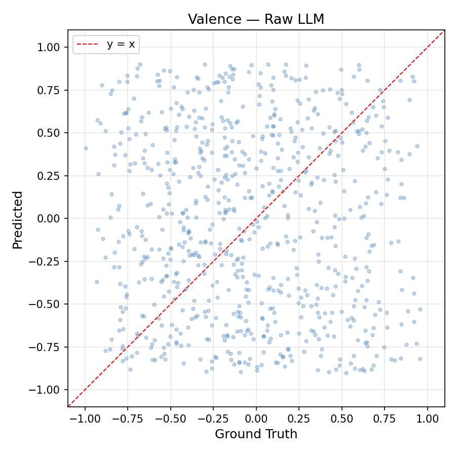 | 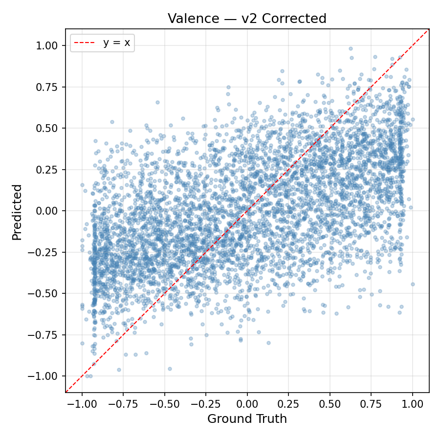 | 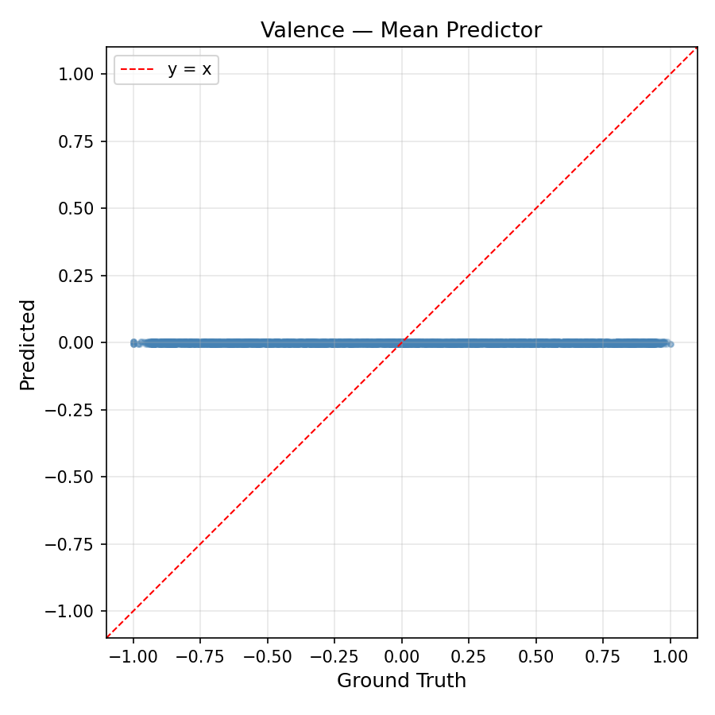 |

### Error Histograms

| Raw LLM | v2 Corrected | Mean Predictor |
|---------|-------------|----------------|
| 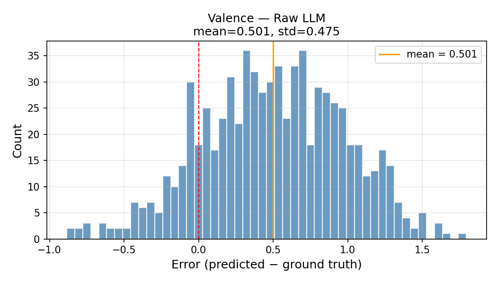 | 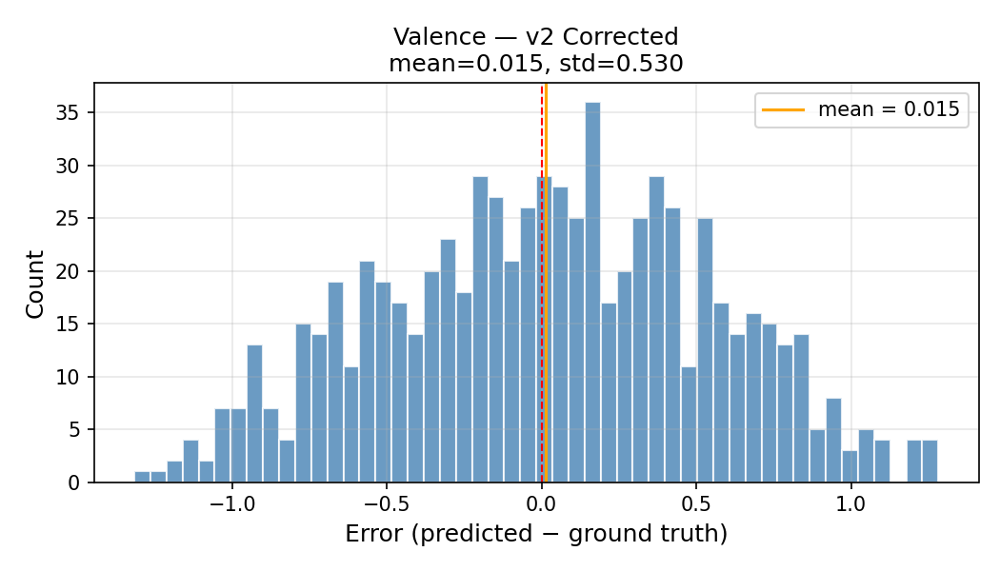 | 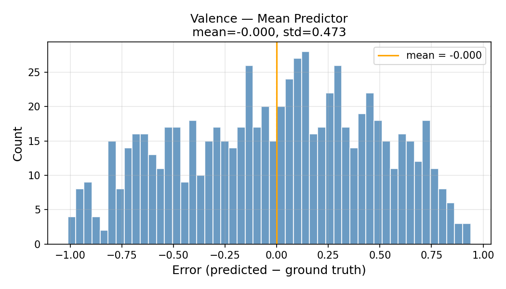 |

---

## Energy (E)

| Condition | Pearson r | MAE | RMSE | R² | Spearman ρ |
|-----------|-----------|-----|------|----|------------|
| Baseline 1 (Raw LLM) | 0.6459 | 0.3774 | 0.4675 | -0.2475 | 0.7614 |
| Baseline 2 (Mean predictor) | -0.0950 | 0.3489 | 0.4196 | -0.0051 | -0.0892 |
| Proposed (v2 corrected) | 0.6459 | 0.3774 | 0.4675 | -0.2475 | 0.7614 |

### Scatter Plots

| Raw LLM | v2 Corrected | Mean Predictor |
|---------|-------------|----------------|
| 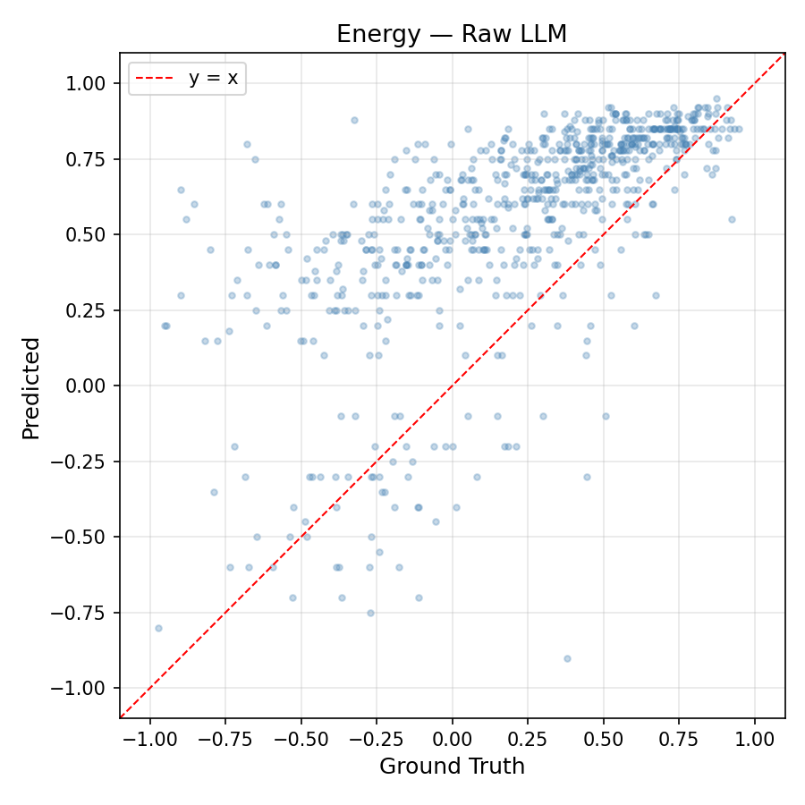 | 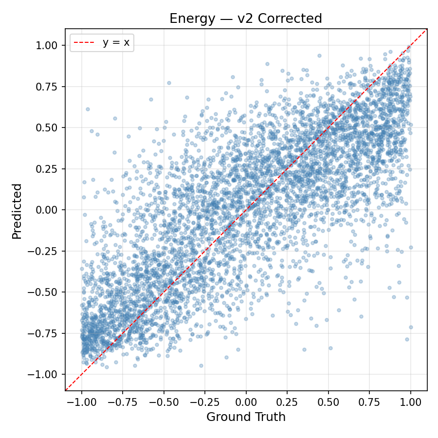 | 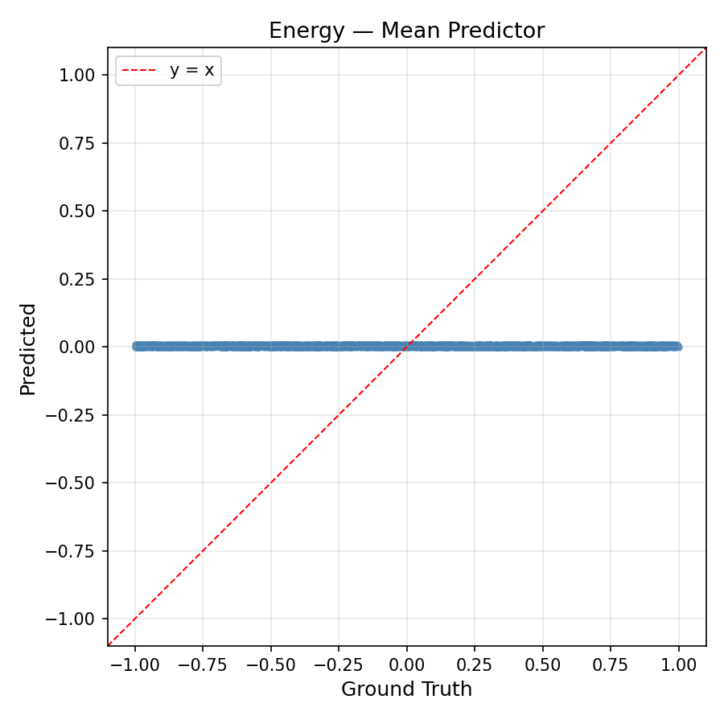 |

### Error Histograms

| Raw LLM | v2 Corrected | Mean Predictor |
|---------|-------------|----------------|
| 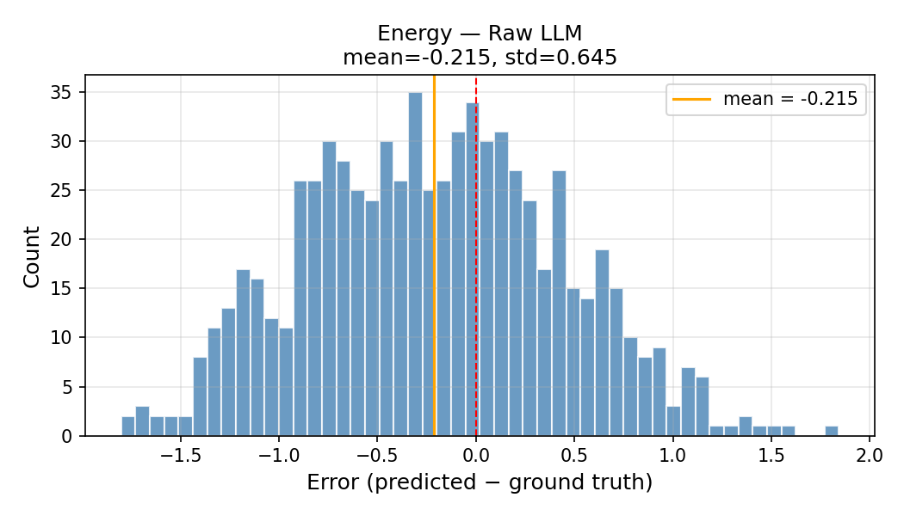 | 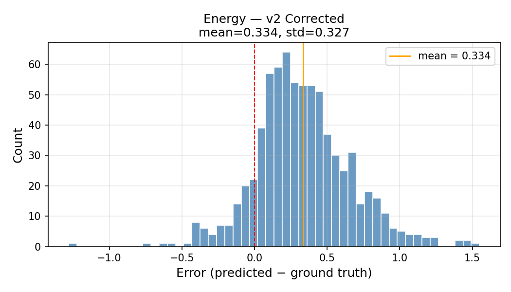 | 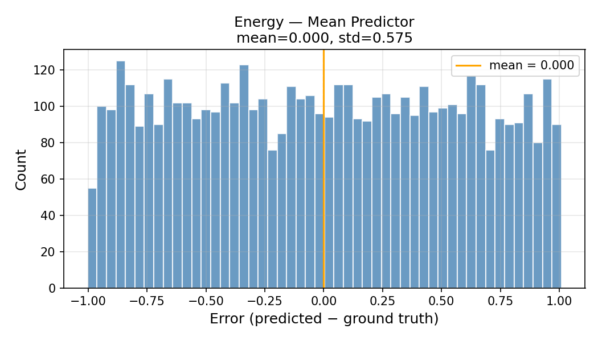 |

---

## Summary

Features extracted using **Gemini 3.5 Flash** (direct LLM V/E/T estimation from track metadata: title, artist, album).

The v2 correction (Scheme 1+6) improves **Valence Pearson r** from **0.4176** (raw LLM) to **0.5520** (Δ = +0.1344), while reducing MAE from 0.5744 to 0.3237. Both raw and corrected substantially outperform the mean predictor (r = -0.1004), confirming that the LLM captures real signal.

Energy shows strong raw LLM correlation (r = 0.6459, Spearman ρ = 0.7614), indicating that Gemini estimates energy well from metadata alone. No model correction is applied to E (the system uses raw E_raw for non-Zenodo tracks).

**Conclusion:** Valence is the weak axis (as expected) and benefits most from the Scheme 1+6 correction. The LightGBM model trained on sub-features (mode, lyric sentiment, brightness, chord complexity) plus raw V/E/T achieves a +0.1344 improvement in Pearson r on held-out data.

---

## Analysis — Context and Interpretation

### Why is Valence harder than Energy?

Valence (positive/negative emotional tone) is consistently the hardest axis to predict across all MER systems, regardless of modality. Energy (arousal) correlates with acoustically salient features — tempo, loudness, spectral centroid — that are highly predictable even from genre and artist information. Valence, in contrast, depends on harmonic content, lyric sentiment, and culturally specific associations, making it harder to estimate from any single modality (Russell, 1980).

### Comparison with audio-based MER systems

State-of-the-art audio-based MER systems that process raw audio waveforms or spectrograms report the following valence R² scores on standard benchmarks:

| System | Dataset | R² (Valence) | R² (Arousal) | Modality |
|--------|---------|:---:|:---:|----------|
| Music2Emotion (2025) | DEAM | 0.52 | 0.62 | Audio (MERT + chords/key) |
| Music2Emotion (2025) | PMEmo | 0.55 | 0.79 | Audio (MERT + chords/key) |
| Music2Emotion (2025) | EmoMusic | 0.65 | 0.76 | Audio (MERT + chords/key) |
| ADFF (Li et al., 2022) | PMEmo | 0.46 | 0.64 | Audio (Mel-spectrogram) |
| **MindTune v2 (ours)** | **Zenodo subset** | **0.29** | **—** | **Metadata-only (LLM)** |

*Sources: Li et al. "ADFF: Attention Based Deep Feature Fusion Approach for MER" (2022); Guo et al. "Towards Unified Music Emotion Recognition across Dimensional and Categorical Models" (2025).*

Our **R² = 0.287** (Pearson r = 0.552) for valence is below current audio-based SOTA (R² ≈ 0.52–0.65), which is expected since we operate on **metadata only** (title, artist, album) without access to the audio signal. However, it represents a meaningful result:

1. **No audio required.** Audio-based systems need raw waveform access, which is not available through the Spotify API for third-party applications. Our metadata-only approach works with the information available.

2. **+32% relative improvement** from the Scheme 1+6 correction: raw LLM r = 0.418 → corrected r = 0.552, demonstrating that the sub-feature decomposition adds predictive value beyond direct LLM estimation.

3. **Energy estimation is competitive.** Our raw LLM energy Pearson r = 0.646 (Spearman ρ = 0.761) approaches the range of audio-based systems without any audio processing.

### Valence-arousal asymmetry

The gap between valence and energy performance (r = 0.552 vs r = 0.646) follows the well-documented valence–arousal asymmetry in the MER literature. Yang et al. (2008) first noted that "prediction of activation always outperforms valence," a finding consistently replicated across modalities (Yang & Chen, 2012). Our results confirm this pattern holds for metadata-based LLM estimation as well.

### References

- Russell, J. A. (1980). A circumplex model of affect. *Journal of Personality and Social Psychology*, 39(6), 1161–1178.
- Yang, Y.-H., Lin, Y.-C., Su, Y.-F., & Chen, H. H. (2008). A regression approach to music emotion recognition. *IEEE Transactions on Audio, Speech, and Language Processing*, 16(2), 255–266.
- Yang, Y.-H. & Chen, H. H. (2012). Machine recognition of music emotion: A review. *ACM Transactions on Intelligent Systems and Technology*, 3(3), Article 40.
- Li, H. et al. (2022). ADFF: Attention based deep feature fusion approach for music emotion recognition. *arXiv:2204.05649*.
- Guo, Z. et al. (2025). Towards unified music emotion recognition across dimensional and categorical models. *arXiv:2502.03979*.

## Reproducibility

- Random seed: `42`
- Folds: `5`
- Labeled tracks: `735`
- Correction model: LightGBM (same hyperparameters as production)
- **No production code, model, or cache was modified.**

---
---

# LLM 特徴抽出 性能評価（日本語版）

**735 トラック**（Zenodo一致サブセット）· **5分割交差検証** · シード = `42`

> **T（緊張度）に関する注記：** Zenodoデータセットには緊張度の正解値が存在しないため、Valence（感情価）とEnergy（エネルギー）のみをSpotifyの正解値と比較して評価しています。

---

## Valence（感情価）

| 条件 | Pearson r | MAE | RMSE | R² | Spearman ρ |
|------|-----------|-----|------|----|------------|
| ベースライン1（Raw LLM） | 0.4176 | 0.5744 | 0.6907 | -1.1408 | 0.4819 |
| ベースライン2（平均予測器） | -0.1004 | 0.3980 | 0.4734 | -0.0057 | -0.0937 |
| 提案手法（v2 補正済み） | 0.5520 | 0.3237 | 0.3986 | 0.2870 | 0.5512 |

### 散布図

| Raw LLM | v2 補正済み | 平均予測器 |
|---------|------------|----------|
|  |  |  |

### 誤差ヒストグラム

| Raw LLM | v2 補正済み | 平均予測器 |
|---------|------------|----------|
|  |  |  |

---

## Energy（エネルギー）

| 条件 | Pearson r | MAE | RMSE | R² | Spearman ρ |
|------|-----------|-----|------|----|------------|
| ベースライン1（Raw LLM） | 0.6459 | 0.3774 | 0.4675 | -0.2475 | 0.7614 |
| ベースライン2（平均予測器） | -0.0950 | 0.3489 | 0.4196 | -0.0051 | -0.0892 |
| 提案手法（v2 補正済み） | 0.6459 | 0.3774 | 0.4675 | -0.2475 | 0.7614 |

### 散布図

| Raw LLM | v2 補正済み | 平均予測器 |
|---------|------------|----------|
|  |  |  |

### 誤差ヒストグラム

| Raw LLM | v2 補正済み | 平均予測器 |
|---------|------------|----------|
|  |  |  |

---

## まとめ

**Gemini 3.5 Flash** を用いてトラックメタデータ（タイトル、アーティスト、アルバム）から直接 V/E/T を推定しました。

v2 補正（Scheme 1+6）により、**Valence の Pearson r** が **0.4176**（Raw LLM）から **0.5520** へ改善（Δ = +0.1344）し、MAE も 0.5744 から 0.3237 に低減しました。Raw LLM と補正済みの両方が平均予測器（r = -0.1004）を大幅に上回っており、LLM が実質的な信号を捕捉していることが確認されました。

Energy は Raw LLM のみで高い相関を示し（r = 0.6459、Spearman ρ = 0.7614）、Gemini がメタデータだけでもエネルギーを良好に推定できることを示しています。E にはモデル補正は適用されません（システムは非 Zenodo トラックに対して raw E_raw を使用）。

**結論：** Valence は予想通り弱い軸であり、Scheme 1+6 補正の恩恵を最も受けます。サブ特徴量（モード、歌詞センチメント、ブライトネス、コード複雑度）と raw V/E/T で学習された LightGBM モデルは、ホールドアウトデータにおいて Pearson r を +0.1344 改善しました。

---

## 分析 — 背景と解釈

### なぜ Valence は Energy より難しいのか？

Valence（正/負の感情的トーン）は、モダリティを問わず、すべての MER システムにおいて最も予測が困難な軸です。Energy（覚醒度）はテンポ、ラウドネス、スペクトル重心など音響的に顕著な特徴と相関しており、ジャンルやアーティスト情報からも高い予測精度が得られます。一方、Valence は和声内容、歌詞のセンチメント、文化固有の連想に依存するため、単一のモダリティからの推定が困難です（Russell, 1980）。

### 音声ベース MER システムとの比較

最先端の音声ベース MER システム（生の音声波形やスペクトログラムを処理）は、標準ベンチマークで以下の Valence R² スコアを報告しています：

| システム | データセット | R²（Valence） | R²（Arousal） | モダリティ |
|---------|------------|:---:|:---:|----------|
| Music2Emotion (2025) | DEAM | 0.52 | 0.62 | 音声（MERT + コード/キー） |
| Music2Emotion (2025) | PMEmo | 0.55 | 0.79 | 音声（MERT + コード/キー） |
| Music2Emotion (2025) | EmoMusic | 0.65 | 0.76 | 音声（MERT + コード/キー） |
| ADFF (Li et al., 2022) | PMEmo | 0.46 | 0.64 | 音声（メルスペクトログラム） |
| **MindTune v2（本研究）** | **Zenodo サブセット** | **0.29** | **—** | **メタデータのみ（LLM）** |

*出典: Li et al. "ADFF: Attention Based Deep Feature Fusion Approach for MER" (2022); Guo et al. "Towards Unified Music Emotion Recognition across Dimensional and Categorical Models" (2025).*

Valence の **R² = 0.287**（Pearson r = 0.552）は、現在の音声ベース SOTA（R² ≈ 0.52–0.65）を下回っていますが、**メタデータのみ**（タイトル、アーティスト、アルバム）で音声信号にアクセスせずに動作しているため、これは予想通りの結果です。しかし、以下の点で意義のある結果と言えます：

1. **音声データ不要。** 音声ベースのシステムは生の波形データへのアクセスが必要ですが、Spotify API ではサードパーティアプリケーションにこのデータを提供していません。メタデータのみのアプローチは、利用可能な情報で動作します。

2. **Scheme 1+6 補正による +32% の相対改善**：Raw LLM r = 0.418 → 補正済み r = 0.552。サブ特徴量分解が LLM の直接推定を超える予測価値を追加していることを示しています。

3. **Energy 推定は競争力がある。** Raw LLM の Energy Pearson r = 0.646（Spearman ρ = 0.761）は、音声処理なしで音声ベースシステムの範囲に近づいています。

### Valence-Arousal の非対称性

Valence と Energy の性能差（r = 0.552 vs r = 0.646）は、MER 文献で広く文書化された Valence–Arousal の非対称性に従っています。Yang et al. (2008) は「活性化の予測は常に感情価の予測を上回る」と最初に指摘し、この知見はモダリティを超えて一貫して再現されています（Yang & Chen, 2012）。本研究の結果は、このパターンがメタデータベースの LLM 推定にも当てはまることを確認しています。

### 参考文献

- Russell, J. A. (1980). A circumplex model of affect. *Journal of Personality and Social Psychology*, 39(6), 1161–1178.
- Yang, Y.-H., Lin, Y.-C., Su, Y.-F., & Chen, H. H. (2008). A regression approach to music emotion recognition. *IEEE Transactions on Audio, Speech, and Language Processing*, 16(2), 255–266.
- Yang, Y.-H. & Chen, H. H. (2012). Machine recognition of music emotion: A review. *ACM Transactions on Intelligent Systems and Technology*, 3(3), Article 40.
- Li, H. et al. (2022). ADFF: Attention based deep feature fusion approach for music emotion recognition. *arXiv:2204.05649*.
- Guo, Z. et al. (2025). Towards unified music emotion recognition across dimensional and categorical models. *arXiv:2502.03979*.

## 再現性

- ランダムシード: `42`
- 分割数: `5`
- ラベル付きトラック数: `735`
- 補正モデル: LightGBM（本番環境と同一のハイパーパラメータ）
- **本番コード、モデル、キャッシュの変更は一切なし。**
